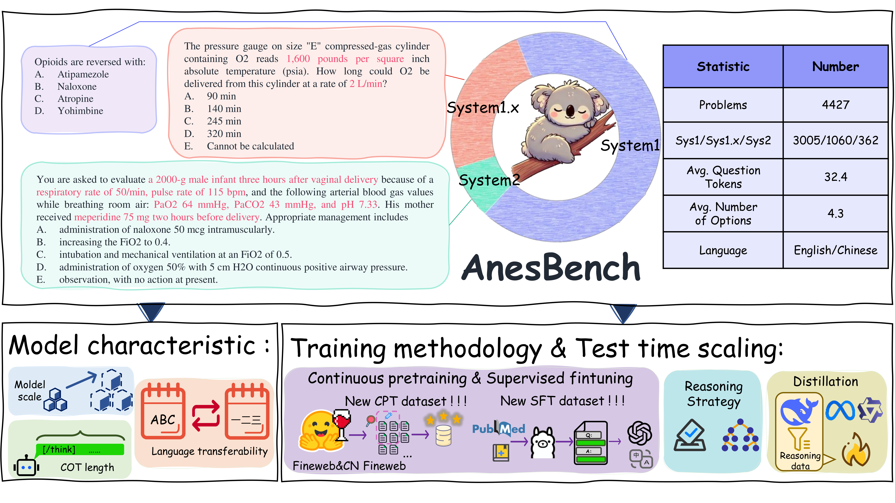

<p align="center">

  <h2 align="center"><strong>AnesBench: Multi-Dimensional Evaluation of LLM Reasoning in Anesthesiology</strong></h2>

<div align="center">
<h5>
<em>Xiang Feng<sup>1 *</sup>, Wentao Jiang<sup>1 *</sup>, Zengmao Wang<sup>1</sup>, Yong Luo<sup>1 †</sup>, Pingbo Xu<sup>2,3</sup>, Baosheng Yu<sup>4</sup>,<br/> Hua Jin<sup>5,6</sup>, Bo Du<sup>1 †</sup>, Jing Zhang<sup>3 †</sup> </em>
    <br><br>
       	<sup>1</sup> School of Computer Science, Wuhan University, China,<br/>
        <sup>2</sup> Department of Anesthesiology, Zhejiang Cancer Hospital, China,<br/> 
        <sup>3</sup> Institute of Medicine, Chinese Academy of Sciences, Hangzhou, Zhejiang, China<br/> 
        <sup>4</sup> Lee Kong Chian School of Medicine, Nanyang Technological University, Singapore<br/> 
        <sup>5</sup> Department of Anesthesiology, First People’s Hospital of Yunnan Province, China<br/> 
        <sup>6</sup> Kunming University of Science and Technology, China<br/> 
</h5>
<h5>
<sup>∗</sup> Equal contribution, <sup>†</sup> Corresponding author
</h5>
</div>


<h5 align="center">
<a href="https://mililab.github.io/anesbench.ai/"> </a> <a href="https://arxiv.org/abs/2504.02404"> </a> <a href="https://huggingface.co/datasets/MiliLab/AnesBench"> </a>
</h5>

<figure>
<div align="center">

</div>
</figure>

# 🐨  Contents

- [🔥 Update](#-update)
- [🌞 Intro](#-intro)
- [🔍 Overview](#-overview)
- [📖 Datasets](#-datasets)
  - [AnesBench](#anesbench)
    - [AnesBench JSON Example](#json-sample)
    - [Field Explanations](#field-explanations)
    - [AnesBench Recommended Usage](#recommended-usage)
- [🐎 Leaderboard](#-leaderboard)


# 🔥 Update
**2025.05.14**
- We released the evaluation code along with usage instructions!!!

**2025.05.13**
- We released AnesBench on HuggingFace!!!

**2025.04.04**
- We uploaded our work on [arXiv](https://arxiv.org/abs/2504.02404)!!!

**2025.03.31**
- We released the [AnesBench project page](https://mililab.github.io/anesbench.ai/) !!!.


# 🌞 Intro
**AnesBench** is designed to assess anesthesiology-related reasoning capabilities of Large Language Models (LLMs). 
It contains 4,427 anesthesiology questions in English. 
Each question is labeled with a three-level categorization of cognitive demands and includes Chinese-English translations, 
enabling evaluation of LLMs’ knowledge, application, and clinical reasoning abilities across diverse linguistic contexts.

# 🔍 Overview
<figure>
<div align="center">

</div>
<div align="center">
<figcaption align = "center"><b>Figure 1: Overview of the AnesBench. 
 </b></figcaption>
</div>
</figure>

# 📖 Datasets

## AnesBench

<a href="https://huggingface.co/datasets/MiliLab/AnesBench"> </a>

### JSON Sample

```json
    {
        "id": "1bb76e22-6dbf-5b17-bbdf-0e6cde9f9440",
        "choice_num": 4,
        "answer": "A",
        "level": 1,
        "en_question": "english question",
        "en_X": "option X",
        "zh_question": "中文问题",
        "zh_X": "选项X",
    }
```

### Field Explanations

| Field         | Type   | Description                                                                 |
|------------------|----------|-----------------------------------------------------------------------------|
| `id`             | string   | A randomly generated ID using UUID                                          |
| `choice_num`     | int      | The number of choices in this question                                      |
| `answer`         | string   | The correct answer to this question                                         |
| `level`          | int      | The cognitive demand level of the question (`1`, `2`, and `3` represent `system1`, `system1.x`, and `system2` respectively) |
| `en_question`    | string   | English description of the question stem                                   |
| `cn_question`    | string   | Chinese description of the question stem                                   |
| `en_X`           | string   | English description of the option                                          |
| `cn_X`           | string   | Chinese description of the option                                          |


### Recommended Usage

- **Question Answering**: QA in a zero-shot or few-shot setting, where the question is fed into a LLM or other QA system. Accuracy could be used as the evaluation metric.

## AnesCorpus

## AnesQA

#  🐎 Leaderboard

| LLM                    |   AnesBench system1 |   AnesBench system1.x |   AnesBench system2 |   AnesBench Overall |   AMCQA system1 |   AMCQA system1.X |   AMCQA system2 |   AMCQA Overall |   Average |
|:-------------------------------|----------:|------------:|----------:|-----------:|----------:|------------:|----------:|-----------:|------------:|
| Qwen3-0.6B                     |      0.39 |        0.31 |      0.26 |       0.36 |      0.37 |        0.35 |      0.31 |       0.37 |        0.36 |
| gemma-3-1b-it                  |      0.33 |        0.26 |      0.21 |       0.3  |      0.26 |        0.25 |      0.21 |       0.26 |        0.28 |
| DeepSeek-R1-Distill-Qwen-1.5B  |      0.32 |        0.28 |      0.27 |       0.31 |      0.26 |        0.26 |      0.22 |       0.26 |        0.28 |
| Qwen3-1.7B                     |      0.48 |        0.37 |      0.3  |       0.44 |      0.54 |        0.5  |      0.44 |       0.53 |        0.48 |
| Qwen3-4B                       |      0.6  |        0.46 |      0.34 |       0.54 |      0.54 |        0.48 |      0.48 |       0.53 |        0.53 |
| gemma-3-4b-it                  |      0.46 |        0.36 |      0.35 |       0.42 |      0.43 |        0.41 |      0.37 |       0.43 |        0.42 |
| chatglm3-6b                    |      0.37 |        0.28 |      0.25 |       0.34 |      0.36 |        0.36 |      0.34 |       0.36 |        0.35 |
| Qwen2.5-7B-Instruct            |      0.56 |        0.44 |      0.36 |       0.52 |      0.68 |        0.63 |      0.58 |       0.67 |        0.59 |
| HuatuoGPT-o1-7B                |      0.56 |        0.45 |      0.38 |       0.52 |      0.71 |        0.65 |      0.63 |       0.7  |        0.61 |
| Baichuan2-7B-Chat              |      0.39 |        0.31 |      0.3  |       0.37 |      0.44 |        0.41 |      0.41 |       0.43 |        0.4  |
| BioMistral-7B                  |      0.43 |        0.3  |      0.32 |       0.39 |      0.26 |        0.25 |      0.28 |       0.26 |        0.32 |
| DeepSeek-R1-Distill-Qwen-7B    |      0.4  |        0.34 |      0.28 |       0.38 |      0.33 |        0.32 |      0.34 |       0.33 |        0.35 |
| Qwen3-8B                       |      0.65 |        0.5  |      0.4  |       0.6  |      0.68 |        0.53 |      0.5  |       0.65 |        0.62 |
| Meta-Llama-3-8B-Instruct       |      0.54 |        0.42 |      0.39 |       0.5  |      0.49 |        0.47 |      0.47 |       0.49 |        0.49 |
| Llama-3.1-8B-Instruct          |      0.58 |        0.45 |      0.36 |       0.53 |      0.53 |        0.53 |      0.55 |       0.53 |        0.53 |
| Llama-3.1-8B-UltraMedical      |      0.63 |        0.47 |      0.41 |       0.57 |      0.54 |        0.52 |      0.5  |       0.54 |        0.56 |
| HuatuoGPT-o1-8B                |      0.58 |        0.46 |      0.39 |       0.53 |      0.57 |        0.53 |      0.57 |       0.56 |        0.55 |
| Llama3-OpenBioLLM-8B           |      0.44 |        0.35 |      0.3  |       0.41 |      0.26 |        0.25 |      0.19 |       0.25 |        0.33 |
| FineMedLM                      |      0.4  |        0.35 |      0.27 |       0.38 |      0.3  |        0.34 |      0.38 |       0.31 |        0.34 |
| FineMedLM-o1                   |      0.43 |        0.34 |      0.26 |       0.39 |      0.34 |        0.38 |      0.4  |       0.35 |        0.37 |
| Bio-Medical-Llama-3-8B         |      0.53 |        0.41 |      0.38 |       0.49 |      0.48 |        0.47 |      0.49 |       0.48 |        0.48 |
| internlm3-8b-instruct          |      0.6  |        0.43 |      0.4  |       0.54 |      0.85 |        0.76 |      0.77 |       0.84 |        0.69 |
| glm-4-9b-chat                  |      0.48 |        0.36 |      0.36 |       0.44 |      0.61 |        0.6  |      0.56 |       0.61 |        0.53 |
| gemma-2-9b-it                  |      0.53 |        0.4  |      0.36 |       0.49 |      0.54 |        0.49 |      0.41 |       0.52 |        0.51 |
| gemma-3-12b-it                 |      0.56 |        0.46 |      0.36 |       0.52 |      0.59 |        0.55 |      0.51 |       0.58 |        0.55 |
| Baichuan2-13B-Chat             |      0.42 |        0.31 |      0.34 |       0.39 |      0.48 |        0.47 |      0.46 |       0.48 |        0.43 |
| phi-4                          |      0.69 |        0.57 |      0.41 |       0.64 |      0.57 |        0.57 |      0.56 |       0.57 |        0.6  |
| DeepSeek-R1-Distill-Qwen-14B   |      0.64 |        0.51 |      0.4  |       0.59 |      0.62 |        0.66 |      0.61 |       0.63 |        0.61 |
| Qwen2.5-14B-Instruct           |      0.61 |        0.52 |      0.41 |       0.57 |      0.74 |        0.7  |      0.62 |       0.73 |        0.65 |
| Qwen3-14B                      |      0.7  |        0.57 |      0.45 |       0.65 |      0.77 |        0.72 |      0.68 |       0.76 |        0.7  |
| gemma-3-27b-it                 |      0.63 |        0.52 |      0.4  |       0.58 |      0.65 |        0.62 |      0.62 |       0.65 |        0.61 |
| gemma-2-27b-it                 |      0.6  |        0.43 |      0.36 |       0.54 |      0.57 |        0.52 |      0.48 |       0.56 |        0.55 |
| Qwen3-30B-A3B                  |      0.73 |        0.6  |      0.48 |       0.68 |      0.73 |        0.71 |      0.7  |       0.73 |        0.7  |
| Qwen3-32B                      |      0.72 |        0.64 |      0.48 |       0.68 |      0.8  |        0.77 |      0.73 |       0.8  |        0.74 |
| DeepSeek-R1-Distill-Qwen-32B   |      0.67 |        0.56 |      0.45 |       0.63 |      0.66 |        0.71 |      0.65 |       0.67 |        0.65 |
| Qwen2.5-32B-Instruct           |      0.65 |        0.55 |      0.44 |       0.61 |      0.77 |        0.73 |      0.69 |       0.76 |        0.68 |
| QwQ-32B-Preview                |      0.69 |        0.58 |      0.44 |       0.64 |      0.74 |        0.7  |      0.68 |       0.73 |        0.68 |
| Yi-1.5-34B-Chat                |      0.54 |        0.44 |      0.35 |       0.5  |      0.65 |        0.64 |      0.64 |       0.65 |        0.57 |
| Llama-3.3-70B-Instruct         |      0.74 |        0.63 |      0.51 |       0.7  |      0.69 |        0.66 |      0.63 |       0.68 |        0.69 |
| Llama-3-70B-UltraMedical       |      0.73 |        0.6  |      0.47 |       0.68 |      0.72 |        0.68 |      0.62 |       0.71 |        0.69 |
| Llama3-OpenBioLLM-70B          |      0.68 |        0.55 |      0.44 |       0.63 |      0.65 |        0.6  |      0.6  |       0.64 |        0.64 |
| Citrus1.0-llama-70B            |      0.71 |        0.6  |      0.52 |       0.67 |      0.71 |        0.69 |      0.67 |       0.71 |        0.69 |
| HuatuoGPT-o1-70B               |      0.7  |        0.58 |      0.48 |       0.65 |      0.7  |        0.7  |      0.64 |       0.7  |        0.68 |
| DeepSeek-R1-Distill-Llama-70B  |      0.77 |        0.68 |      0.56 |       0.73 |      0.64 |        0.64 |      0.59 |       0.64 |        0.68 |
| HuatuoGPT-o1-72B               |      0.71 |        0.61 |      0.48 |       0.67 |      0.82 |        0.78 |      0.78 |       0.81 |        0.74 |
| Qwen2.5-72B-Instruct           |      0.72 |        0.6  |      0.48 |       0.67 |      0.82 |        0.77 |      0.76 |       0.81 |        0.74 |
| Qwen3-235B-A22B                |      0.78 |        0.67 |      0.57 |       0.74 |      0.76 |        0.73 |      0.69 |       0.75 |        0.74 |
| Llama-4-Scout-17B-16E-Instruct |      0.77 |        0.66 |      0.55 |       0.72 |      0.8  |        0.73 |      0.68 |       0.78 |        0.75 |
| deepseek-v3                    |      0.77 |        0.69 |      0.55 |       0.73 |      0.79 |        0.77 |      0.7  |       0.78 |        0.76 |
| deepseek-r1                    |      0.85 |        0.78 |      0.7  |       0.82 |      0.88 |        0.85 |      0.81 |       0.87 |        0.85 |
| gpt-4o                         |      0.81 |        0.72 |      0.59 |       0.77 |      0.78 |        0.77 |      0.68 |       0.78 |        0.77 |


# 🔨 Evaluation

---

## 📁 0. Clone the Repository & Download Benchmark

Clone Repository:

```bash
git clone https://github.com/MiliLab/AnesBench
cd AnesBench
```

Download Benchmark:
```bash
cd benchmark
huggingface-cli download --repo-type dataset  MiliLab/AnesBench --local-dir ./
```
---

## 🧱 1. Prepare the Runtime Environment

Before starting, ensure that `CUDA` and its compiler `nvcc` are properly installed and accessible.

### Check:
```bash
nvcc --version
```

We recommend separating the SGLang service environment from the inference environment.

### SGLang service environment

```bash
conda create -n sglang_server python==3.10
conda activate sglang_server
```

Then, install the required `sglang` and `flashinfer` packages.

```bash
pip install "sglang[all]"
pip install sglang-router 
```
Download the wheel file for your environment from [https://github.com/flashinfer-ai/flashinfer/releases](https://github.com/flashinfer-ai/flashinfer/releases).

```bash
pip install /path/to/flashinfer-wheel
```

### Inference environment

Create a new environment and install the packages based on the requirements file.

```bash
conda create -n inference python==3.10
conda activate inference
cd eval
pip install -r requirements.txt
```
---

### Environment Variables

Prepare environment variables in the `.env` file.

```bash
export RESULT_SAVE_PATH=/path/to/result_save_dir
export MODEL_PATH=/path/to/model
export BENCHMARK_PATH=/path/to/benchmark
```

and run:

```bash
source .env
```

## ▶️ 2. Run Evaluation

### For SGLang service
```bash
bash sglang_server.sh 
```

### For Inference
```bash
python ./evaluate.py --config ./config.yaml 
```


# ⭐ Citation

If you find AnesBench helpful, please consider giving this repo a ⭐ and citing:

```latex
@article{AnesBench,
  title={AnesBench: Multi-Dimensional Evaluation of LLM Reasoning in Anesthesiology},
  author={Xiang Feng and Wentao Jiang and Zengmao Wang and Yong Luo and Pingbo Xu and Baosheng Yu and Hua Jin and Bo Du and Jing Zhang},
  journal={arXiv preprint arXiv:2504.02404},
  year={2025}
}
```
